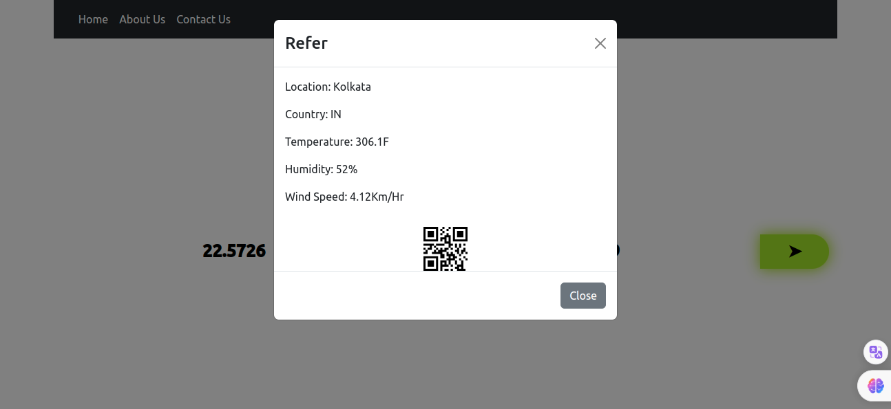

# Weather Monitoring Application


A weather monitoring system is a technological solution designed to collect, process, analyze, and present data related to atmospheric conditions, such as temperature, humidity, pressure, wind speed, precipitation, and more. These systems are crucial for various applications, including agriculture, aviation, transportation, disaster management, and scientific research. Here's a comprehensive description of a typical weather monitoring system:

- Real-time Data Collection
- Data Processing and Analysis
- Forecasting
- Alerting and Notification

## Technology
- React JS (18.0)
- Open weather API

## Compatibility
- [NPM  (8.14.0)](https://monovm.com/blog/install-npm-on-ubuntu)
- [Node (16.0.0)]()
- [NPX  (8.14.0)]()
- [React Cli (5.0.0)](https://www.npmjs.com/package/react-cli)
## Installation and setup
> Clone the Application
```sh
$ git clone https://github.com/sagnikcapital/weather-app.git
```
```sh
$ cd weather-app
```
> Setup 
```sh
$ npm install
```
> Create .env file and add the API key there. Please refer this link: https://home.openweathermap.org/api_keys
```sh
$ cp .env.example .env
```
> Fille the details at .env file
```env
REACT_APP_API_KEY=''
REACT_APP_WEATHER_API_URL='https://api.openweathermap.org/data/2.5/weather'
REACT_APP_CONTACT_SUBMIT=''
REACT_APP_POST_CONTACTS_URL=''
```
```sh
$ npm start
```
### Preview

### Pages
- Home:  `/`
- Contact Us: `/contact-us`
- About Us: `/about-us`

### Demo
- Refer: https://sagnikd-weather-app.vercel.app/
### API Details:
| URL     |     Parameters    |    Method
|---------|-------------------|--------------
|https://api.openweathermap.org/data/2.5/weather?lat={lat}&lon={lon}&appid={API key} |  `lat`, `lon` | GET |
|REACT_APP_CONTACT_SUBMIT| `name`, `email`, `message` | POST|
|https://api.openweathermap.org/data/2.5/weather?q={city name},{country code}&appid={API key} | `city_name`, `api_key`, `country_code` | GET |
### `npm run build` fails to minify

This section has moved here: [https://facebook.github.io/create-react-app/docs/troubleshooting#npm-run-build-fails-to-minify](https://facebook.github.io/create-react-app/docs/troubleshooting#npm-run-build-fails-to-minify)

### [Sagnik Dey](https://in.linkedin.com/in/sagnik-dey-483423a9)

 ---
## 💻 Tech Stack
                    
       
